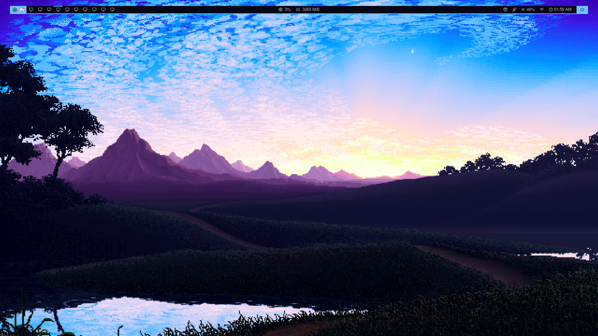

# Dotfiles
These are my dotfiles to use in my Desktop Workstation and Laptop. 
It uses chezmoi for setting things up.

## How to install
To install those dotfiles, run the following command:
```sh
sh -c "$(curl -fsLS git.io/chezmoi)" -- init --apply hnrq
```


